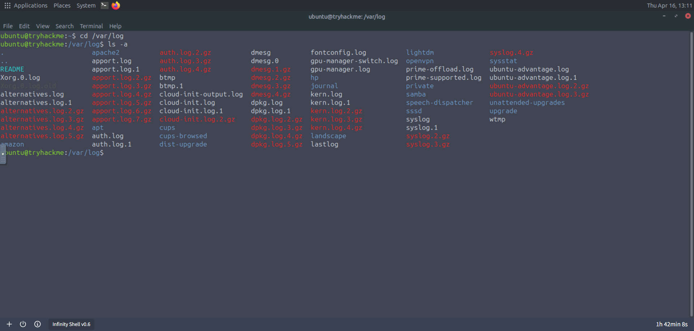
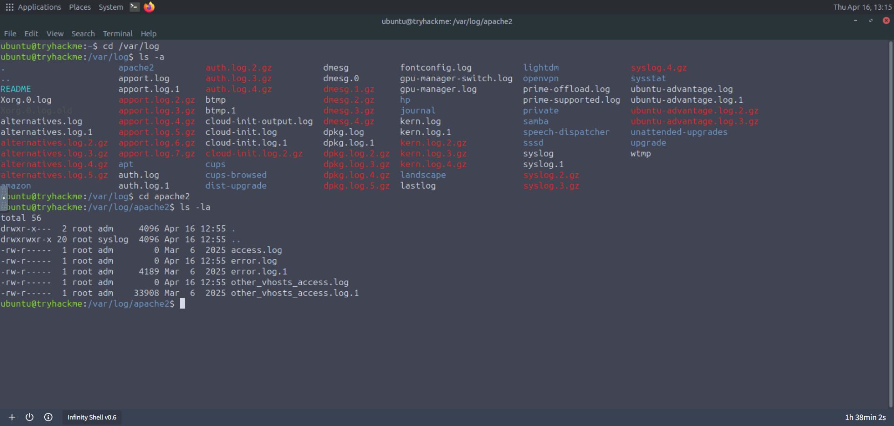
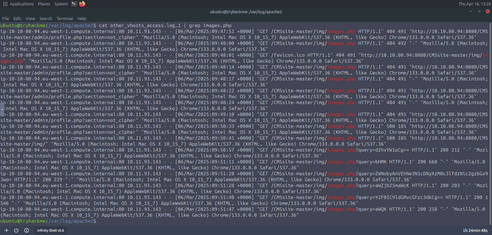
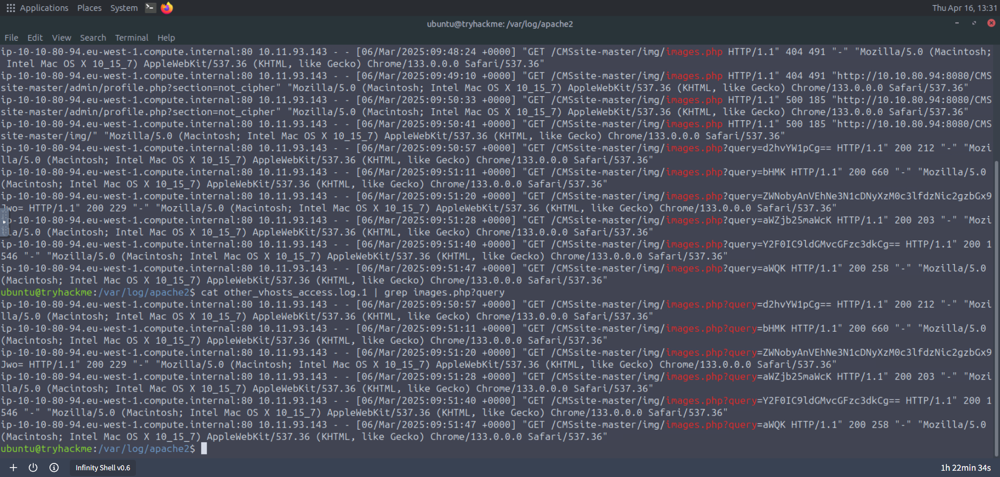
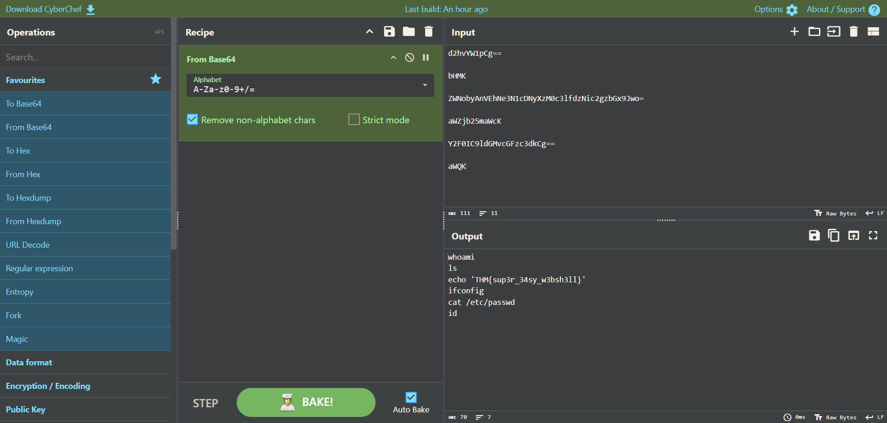

# Infinity Shell
Investigate and analyse the traces of an attack from an implanted webshell.

[TryHackMe Room](https://tryhackme.com/room/hfb1infinityshell)

## Introduction
Cipher’s legion of bots has exploited a known vulnerability in our web application, leaving behind a dangerous web shell implant. Investigate the breach and trace the attacker's footsteps!

## Tools Used
- CyberChef

---
---

## Answer the questions below
### 1. What is the flag?
The objective is to investigate web app vulnerability, so the focus will be on investigating web server logs.

Upon heading into /var/log, only the apache2 was present. 



To be time efficient, only the unusually large file were investigated. This was achieved by using the command:

```bash
ls -la
```



During the investigation of the **other_vhosts_access.log.1** file, what stood out is the **images.php** script in the **/CMSsite-master/img** diretory, which is unusual as typically it should only contain image files (e.g., .jpg, .png). This was achieved by using the command:

```bash
cat other_vhosts_access.log.` | grep images.php
```



To further narrow down the investigation, the focus was turned to the requests with suspicious query parameters containing Base64 encoded strings. This was achieved by using the command:

```bash
cat other_vhosts_access.log.` | grep images.php?query
```



CyberChef was utilized to decode the values, resulting to discovering the enumeration commands of the attacker along with the Flag <mark>THM{sup3r_34sy_w3bsh3ll}</mark> to accomplish the Room.



---
---
