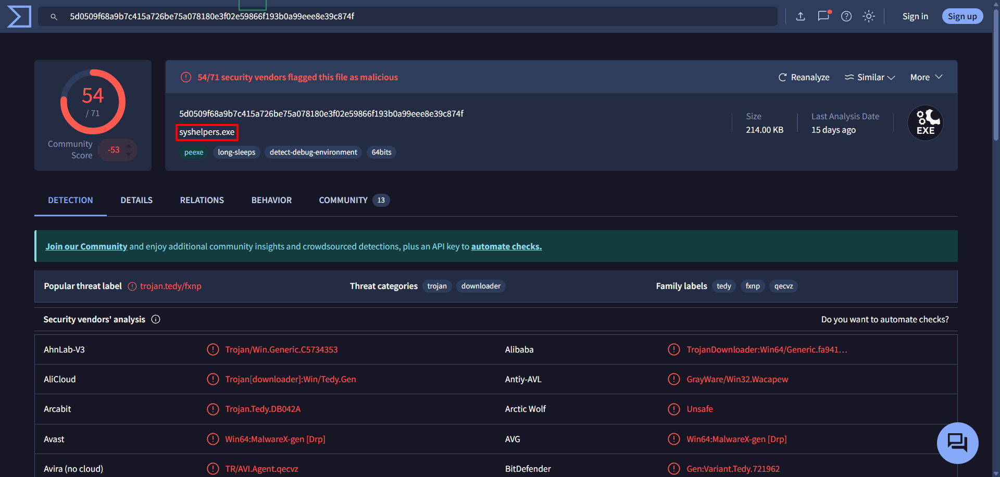
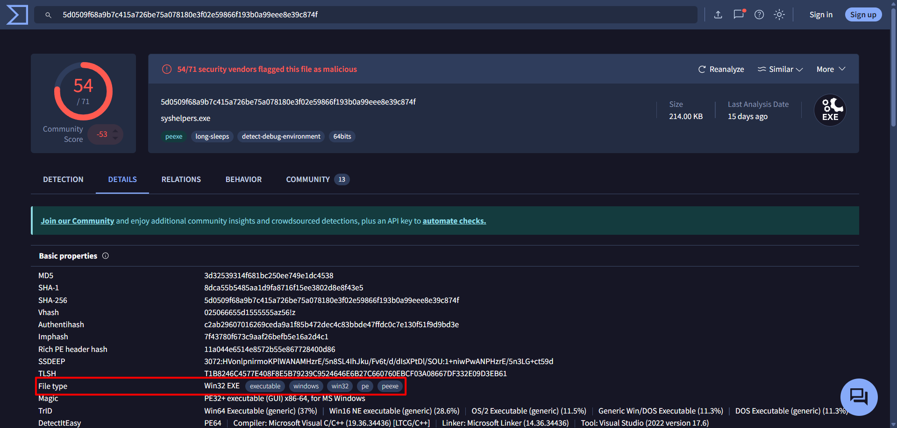
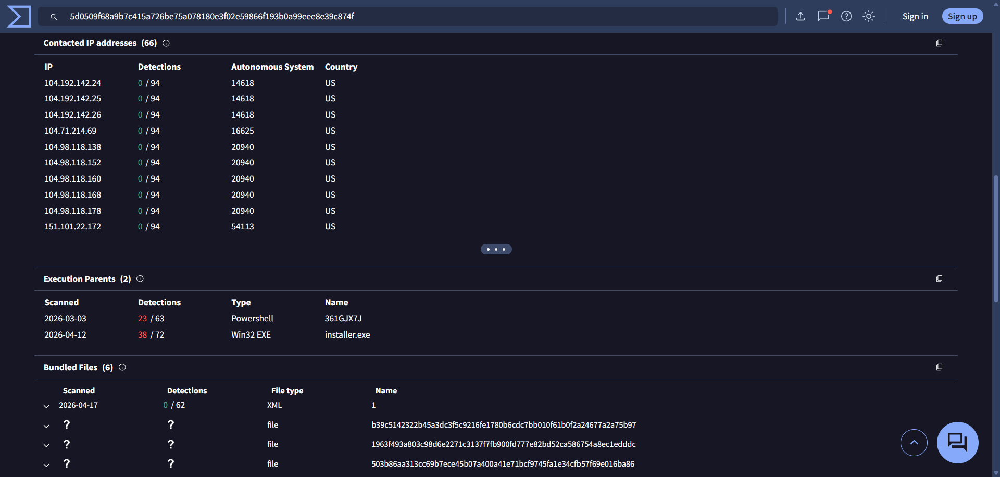
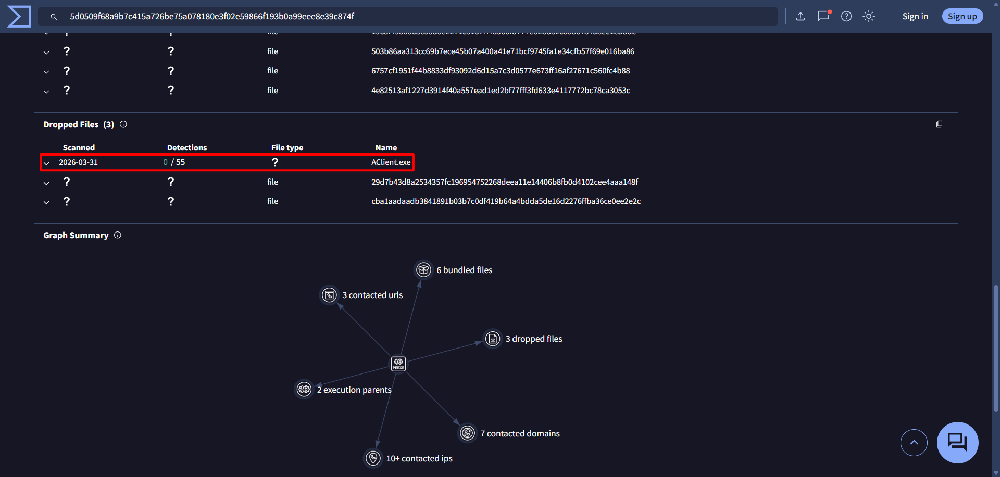
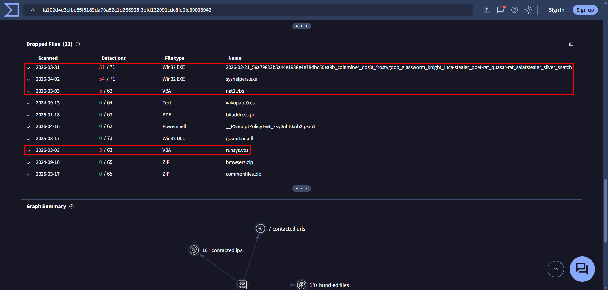
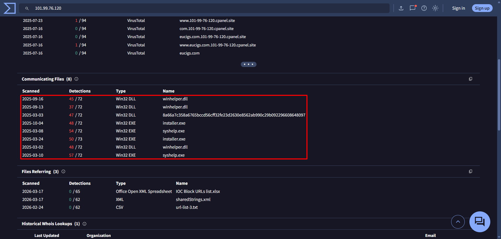

# Invite Only
Extract insight from a set of flagged artefacts, and distil the information into usable threat intelligence.

[TryHackMe Room](https://tryhackme.com/room/invite-only)

## Introduction
You are an SOC analyst on the SOC team at Managed Server Provider TrySecureMe. Today, you are supporting an L3 analyst in investigating flagged IPs, hashes, URLs, or domains as part of IR activities. One of the L1 analysts flagged two suspicious findings early in the morning and escalated them. Your task is to analyse these findings further and distil the information into usable threat intelligence.

Flagged IP: **101[.]99[.]76[.]120**

Flagged SHA256 hash: **5d0509f68a9b7c415a726be75a078180e3f02e59866f193b0a99eee8e39c874f**

We recently purchased a new threat intelligence search application called TryDetectThis2.0. You can use this application to gather information on the indicators above.

## Tools Used
- VirusTotal

--- 
---

# Answer the questions below
### 1. What is the name of the file identified with the flagged SHA256 hash?
As per VirusTotal, the SHA-256 hash corresponds to <mark>`syshelpers.exe`</mark>.

### 2. What is the file type associated with the flagged SHA256 hash?
Under the Details tab, the file type is <mark>Win32 EXE</mark>.

### 3. What are the execution parents of the flagged hash? List the names chronologically, using a comma as a separator. Note down the hashes for later use.
Under the Relations tab, the execution parents are <mark>`361GJX7J`</mark> and <mark>`installer.exe`</mark>.

### 4. What is the name of the file being dropped? Note down the hash value for later use.
While the analysis revealed that some files had unknown attributes (`?`) indicating incomplete data, one file (<mark>`AClient.exe`</mark>) was fully processed for more investigation.

### 5. Research the second hash in question 3 and list the four malicious dropped files in the order they appear (from up to down), separated by commas.
The second hash that is being referenced to is the `installer.exe`. The malicious dropped files were <mark>`searchhost.exe`</mark>, <mark>`syshelpers.exe`</mark>, <mark>`nat1.vbs`</mark>, and <mark>`runsys.vbs`</mark>.

### 6. Analyse the files related to the flagged IP. What is the malware family that links these files?
Reviewing the communicating files shows that these files belong to the <mark>AsyncRAT</mark> family.

### 7. What is the title of the original report where these flagged indicators are mentioned? Use Google to find the report.
After doing some OSINT, the title of the original report was <mark>[From Trust to Threat: Hijacked Discord Invites Used for Multi-Stage Malware Delivery](https://research.checkpoint.com/2025/from-trust-to-threat-hijacked-discord-invites-used-for-multi-stage-malware-delivery/)</mark>.

### 8. Which tool did the attackers use to steal cookies from the Google Chrome browser?
<mark>ChromeKatz</mark> was used to steal cookies, bypassing Chrome’s App Bound Encryption [ABE].

### 9. Which phishing technique did the attackers use? Use the report to answer the question.
The attackers used <mark>ClickFix</mark>, "a technique in which the service initially appears broken, prompting the user to take manual action to fix it” (Check Point Research, 2025).

### 10. What is the name of the platform that was used to redirect a user to malicious servers?
<mark>Discord</mark>'s custom invite links were actively exploited as a redirection method.

---
---

## References
- VirusTotal: https://www.virustotal.com/gui/ip-address/101.99.76.120
- VirusTotal: https://www.virustotal.com/gui/file/5d0509f68a9b7c415a726be75a078180e3f02e59866f193b0a99eee8e39c874f
- VirusTotal: https://www.virustotal.com/gui/file/fa102d4e3cfbe85f5189da70a52c1d266925f3efd122091cdc8fe0fc39033942
- Check Point Research. (2025). *From trust to threat: hijacked Discord invites used for multi-stage malware delivery*. https://research.checkpoint.com/2025/from-trust-to-threat-hijacked-discord-invites-used-for-multi-stage-malware-delivery/
