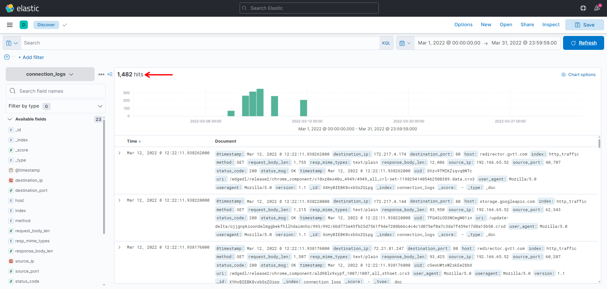
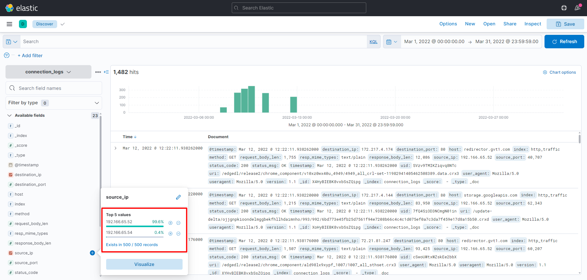
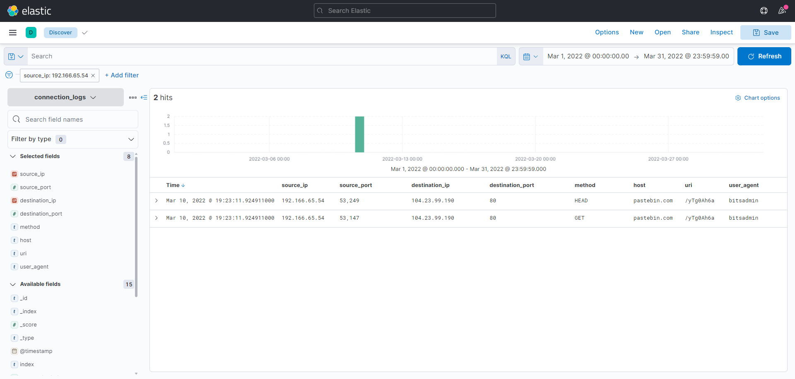
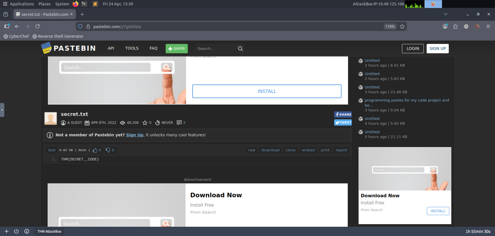

# ItsyBitsy
Put your ELK knowledge together and investigate an incident.

[TryHackMe Room](https://tryhackme.com/room/itsybitsy)

## Introduction
In this challenge room, we will take a simple challenge to investigate an alert by IDS regarding a potential C2 communication.

## Tools Used
- Kibana

---
---

## Answer the questions below

*During normal SOC monitoring, Analyst John observed an alert on an IDS solution indicating a potential C2 communication from a user Browne from the HR department. A suspicious file was accessed containing a malicious pattern THM:{ ________ }. A week-long HTTP connection logs have been pulled to investigate. Due to limited resources, only the connection logs could be pulled out and are ingested into the `connection_logs` index in Kibana.*

*Our task in this room will be to examine the network connection logs of this user, find the link and the content of the file, and answer the questions.*

### 1. How many events were returned for the month of March 2022?
By filtering the date from only the month of March 2022, <mark>1482</mark> events were discovered.

### 2. What is the IP associated with the suspected user in the logs?
The data was approached by tackling the low-hanging fruit first, starting with the IP `192.166.65.54` as it was linked to just 0.4% of the dataset. This allowed for faster triage.

The next step was to build a table with fields that are relevant to view specific data in a tidy and structured way.

IP <mark>`192.166.65.54`</mark> was determined to be suspicious for several reasons: it communicated to an external IP over unencrypted traffic, interacted with `pastebin[.]com` using the `GET` request method (a known staging area for attackers), and utilized `bitsadmin`, commonly abused tool for file transfers

### 3. The user’s machine used a legit windows binary to download a file from the C2 server. What is the name of the binary?
The binary used was <mark>`bitsadmin`</mark>. a LOLBin to bypass security systems.

### 4. The infected machine connected with a famous filesharing site in this period, which also acts as a C2 server used by the malware authors to communicate. What is the name of the filesharing site?
<mark>`pastebin[.]com`</mark> was used as a C2 server.

### 5. What is the full URL of the C2 to which the infected host is connected?
The full URL of the server is <mark>`pastebin[.]com/yTg0Ah6a`</mark>.

### 6. A file was accessed on the filesharing site. What is the name of the file accessed?
By using the virtual machine to safely investigate the URL, the <mark>`secret.txt`</mark> file was discovered.

### 7. The file contains a secret code with the format THM{_____}.
Inside the file is the flag <mark>THM{SECRET__CODE}</mark> to accomplish the room.

---
---

## References
- Pastebin: `hxxps[://]pastebin[.]com/yTg0Ah6a`
