# Shadow Trace
Analyse a suspicious file, uncover hidden clues, and trace the source of the infection.

[TryHackMe Room](https://tryhackme.com/room/shadowtrace)

## Introduction
It’s the middle of the night shift. You’re the only analyst in the SOC when a manager calls in urgently: a suspicious file was found on a user's machine and needs immediate review.

You open the file and start digging. Something doesn’t look normal for a company updater, and at the same time, the EDR throws a couple of alerts.

Your task: analyse the file, collect anything to identify it, gather any potential IOCs, correlate and analyse the alerts for potential malicious behaviour. It’s up to you to piece together what’s happening before it spreads further.

## Objectives
- Extract IOCs from suspicious binaries
- Correlate alerts with malicious activity
- Perform basic SOC triage actions

## Tools Used
- CyberChef
- dCode
- PEStudio

---
---

## Answer the questions below
### 1. What is the architecture of the binary file windows-update.exe?
Utilizing PEStudio, the binary was identified as a <mark>64-bit</mark> executable.

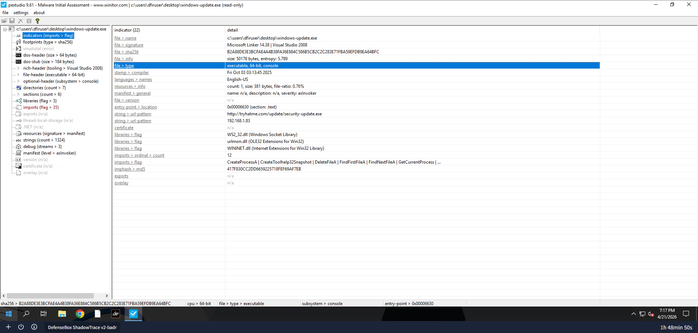

### 2. What is the hash (sha-256) of the file windows-update.exe?
The SHA-256 hash of the file is <mark>`b2a88de3e3bcfae4a4b38fa36e884c586b5cb2c2c283e71fba59efdb9ea64bfc`</mark>.

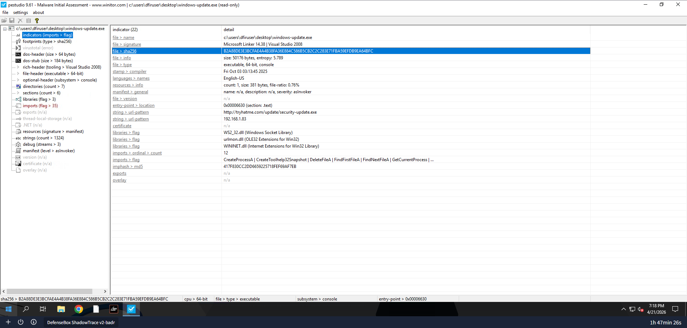

### 3. Identify the URL within the file to use it as an IOC
A suspicious URL was extracted from the binary, <mark>`hxxp[://]tryhatme[.]com/update/security-update[.]exe`</mark>.

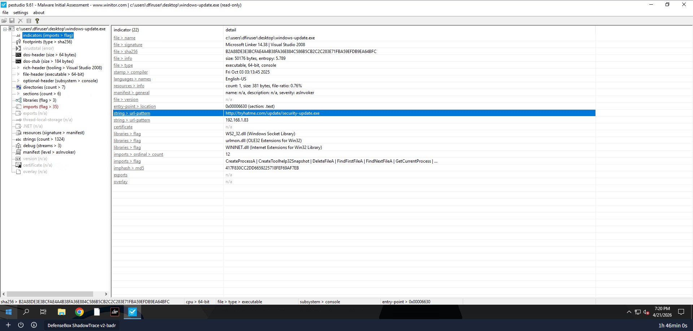

### 4. With the URL identified, can you spot a domain that can be used as an IOC?
Analysis of the strings section revealed the domain <mark>`responses[.]tryhatme[.]com`</mark>.

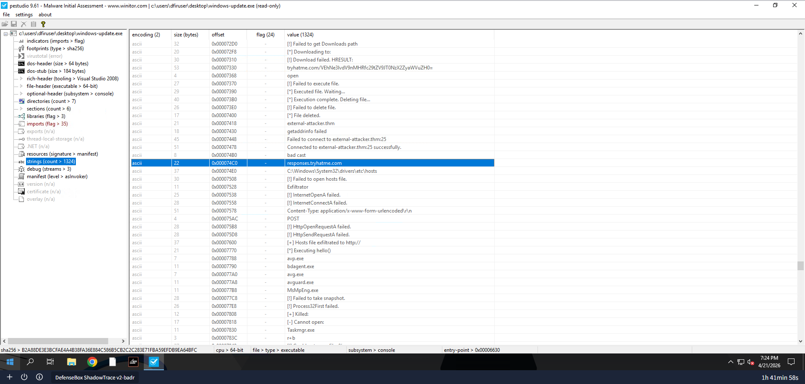

### 5. Input the decoded flag from the suspicious domain
Further analysis of the strings section discovered the Base64-encoded string `VEhNe3lvdV9nMHRfc29tZV9JT0NzX2ZyaWVuZH0=` against `tryhatme[.]com`. 

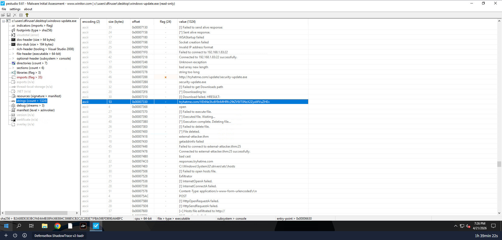

In order to decode this, CyberChef was used and it revealed the flag <mark>THM{you_g0t_some_IOCs_friend}</mark>.

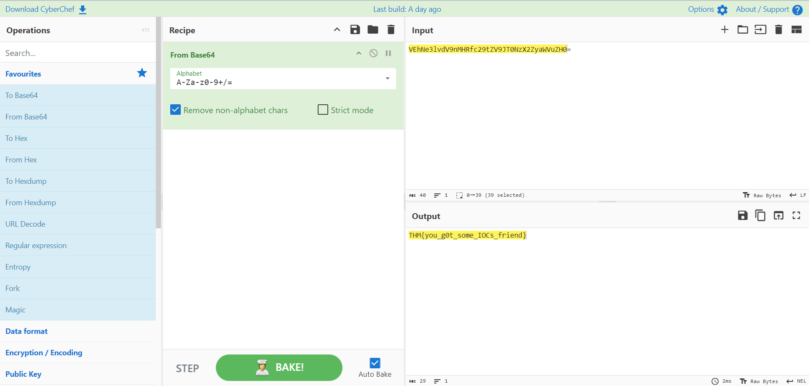

### 6. What library related to socket communication is loaded by the binary?
The binary imports <mark>`WS2_32.dll`</mark>, which is the core Windows library for implementing socket communication.

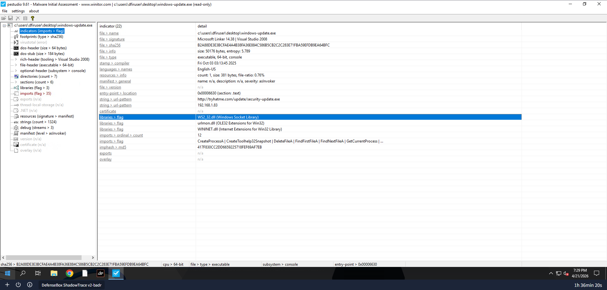

---

### 7. Can you identify the malicious URL from the trigger by the process powershell.exe?
There is a Base64-encoded string in the command, `aHR0cHM6Ly90cnloYXRtZS5jb20vZGV2L21haW4uZXhl`.

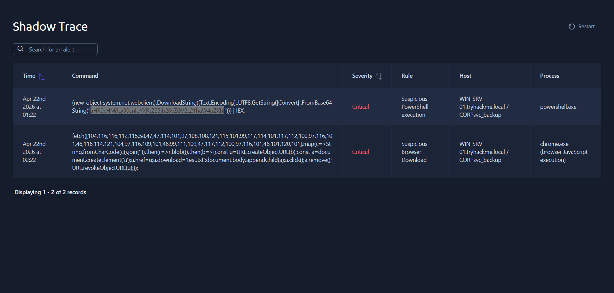

CyberChef was utilized to decipher the string and obtain the URL <mark>`hxxps[://]tryhatme[.]com/dev/main[.]exe`</mark>.

### 8. Can you identify the malicious URL from the alert triggered by chrome.exe?
The command fetches decimal values which are converted to characters by using the `String.fromCharCode()` function.

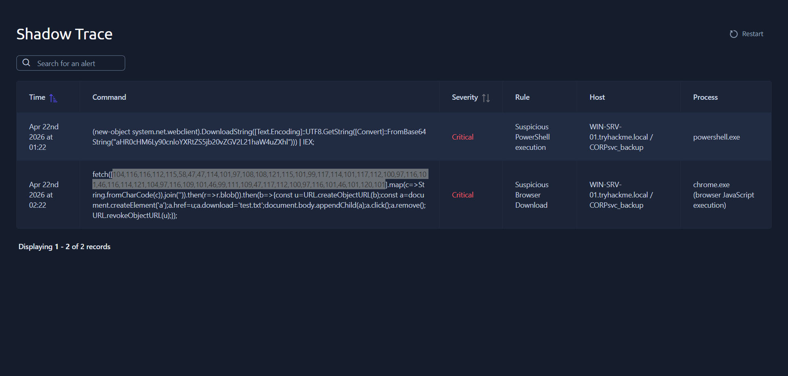

To confirm, the encoded string was identified as ASCII-encoded using dCode.

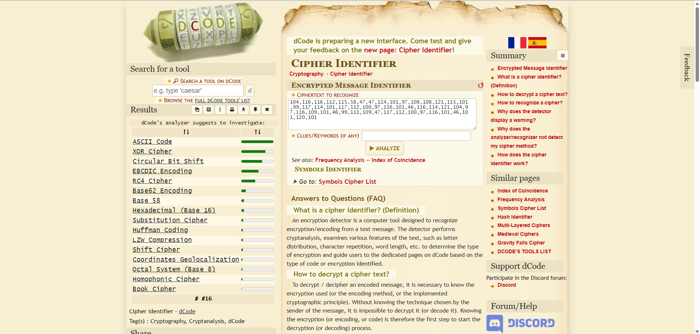

After decoding, the following URL was uncovered to be <mark>`hxxps[://]reallysecureupdate[.]tryhatme[.]com/update[.]exe`</mark> URL.

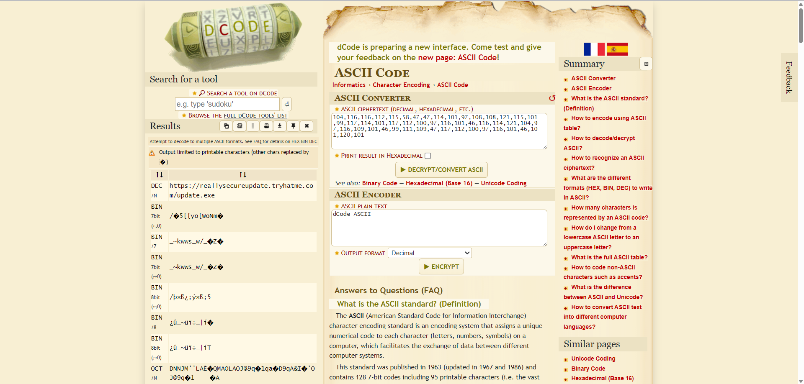

### 9. What's the name of the file saved in the alert triggered by chrome.exe?
It shows in the command that the file <mark>`test.txt`</mark> was downloaded.

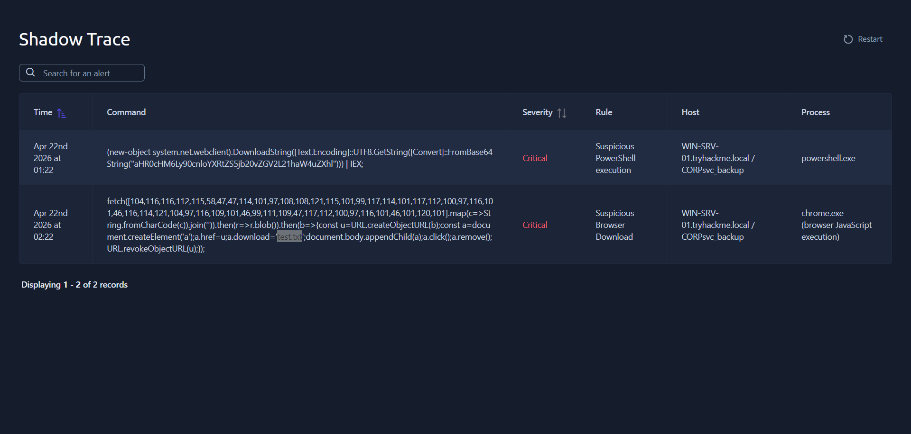

---
---

## References
- CyberChef: https://gchq.github.io/CyberChef/#recipe=From_Base64('A-Za-z0-9%2B/%3D',true,false)&input=VkVoTmUzbHZkVjluTUhSZmMyOXRaVjlKVDBOelgyWnlhV1Z1WkgwPQ
- CyberChef: https://gchq.github.io/CyberChef/#recipe=From_Base64('A-Za-z0-9%2B/%3D',true,false)&input=YUhSMGNITTZMeTkwY25sb1lYUnRaUzVqYjIwdlpHVjJMMjFoYVc0dVpYaGw
- dCode: https://www.dcode.fr/cipher-identifier&v5
- dCode: https://www.dcode.fr/ascii-code&v5

