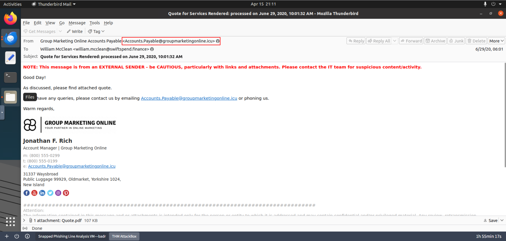
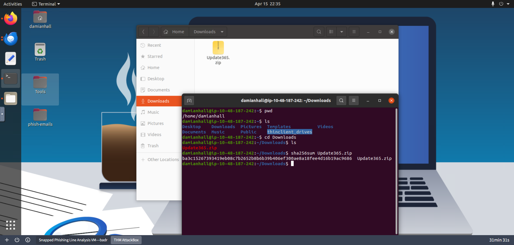
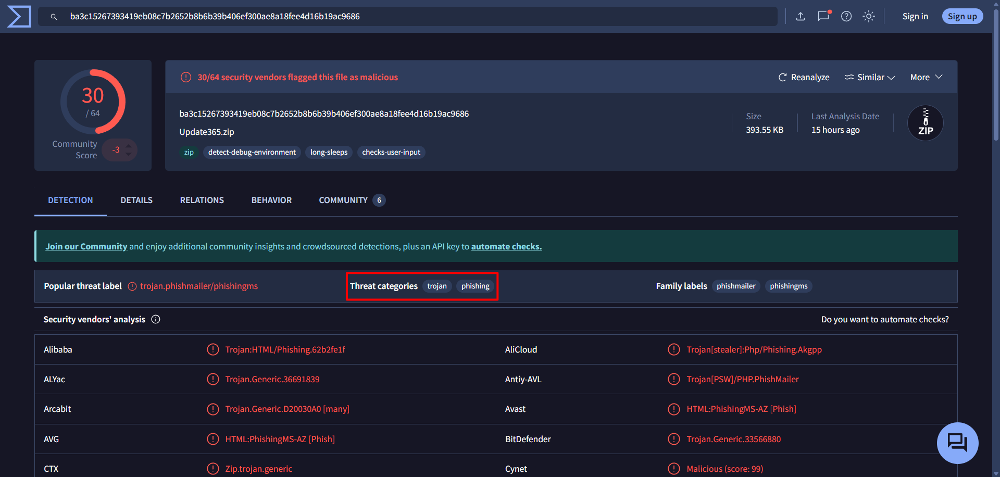
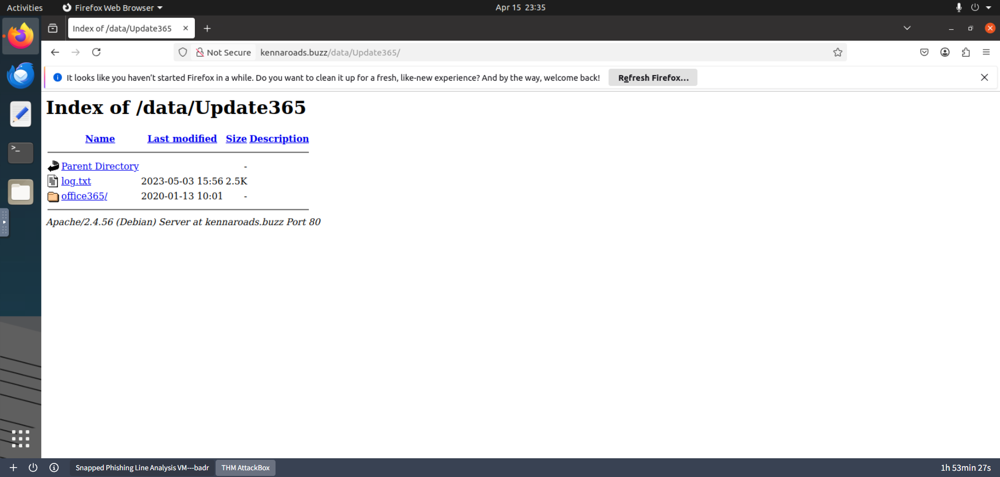
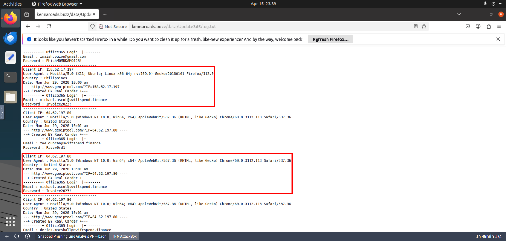
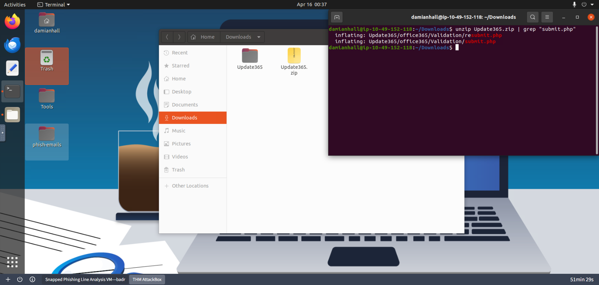
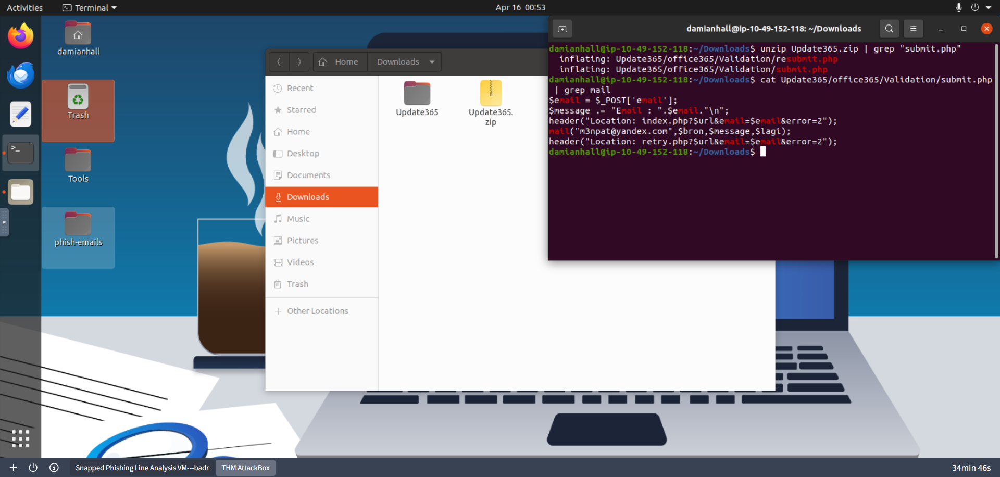
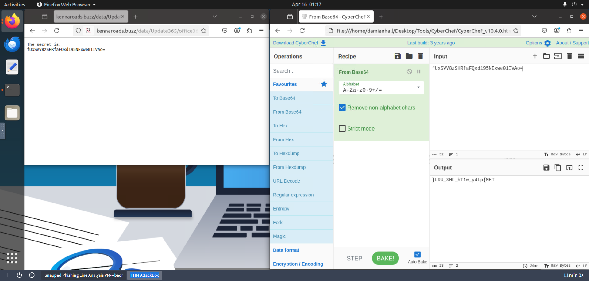
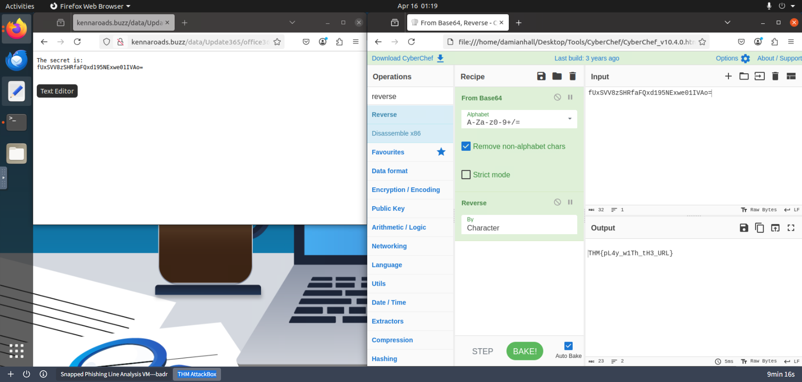

# Snapped Phish-ing Line
Apply learned skills to probe malicious emails and URLs, exposing a vast phishing campaign.

[TryHackMe Room](https://tryhackme.com/room/snappedphishingline)

## Introduction
As a member of the IT department at SwiftSpend Financial, you are responsible for assisting employees with technical concerns. What initially appeared to be a routine day quickly escalated when multiple employees across different departments reported receiving a suspicious email. Several users noted unusual characteristics in the message, and unfortunately, some had already submitted their credentials and were no longer able to access their accounts. With the potential for a wider compromise, the incident has been escalated for investigation. Your task is to analyze the available evidence, determine the scope of the attack, and uncover how the adversary operated.

## Objectives
- Analyze the provided email samples to identify key artifacts
- Investigate phishing URLs to understand redirection
- Retrieve and examine the phishing kit used in the attack
- Use CTI tools to gather intelligence on the adversary
- Analyze the phishing kit to uncover additional indicators

## Tools Used
- CyberChef
- VirusTotal
  
---
---

## Answer the questions below
### 1. Begin reviewing the emails in the phish-emails folder on your desktop. Which individual received the email regarding a *Quote for Services Rendered*?
By accessing the phish-emails folder on the Desktop, the email about the Quote for Services Rendered can be investigated. The **To** field indicates that **William McClean** received the email.
     


   
### 2. What email address was used by the adversary to send the phishing emails?
In examining the **From** field, the adversary used **Accounts.Payable@groupmarketingonline.icu** to deliver the phishing emails.



### 3. Investigate the attachment in the email addressed to Zoe Duncan. What is the root domain of the redirection URL found within the file?
To further examine the attachment, it was opened using Firefox. The domain is **kennaroads.buzz**.
  


### 4. Open the attachment in your VM web browser. Which company is the login page impersonating?
It is impersonating **Microsoft**.

### 5. Let’s check if the attacker left any files exposed on the same website. Navigate to the */data* directory. What is the name of the archive file?
By only navigating to this **http://kennaroads.buzz/data/** path, the **Update365.zip** can be located.
  


### 6. Download the phishing kit archive to your virtual environment. Using the *sha256sum* command, what is the *SHA256* hash of the file?
After downloading the phishing kit, the command **sha256sum Update365.zip** was ran to generate its hash, **ba3c15267393419eb08c7b2652b8b6b39b406ef300ae8a18fee4d16b19ac9686**.


   
### 7. Investigate the file hash from the previous question using VirusTotal. Aside from *phishing*, what other threat category is assigned to the *ZIP* archive?
It is also listed as **Trojan**.



### 8. Review the VirusTotal Details page for the phishing kit. How many files are contained within the archive?
In the Details tab, under Bundle Info, its metadata says that it contains **49** files.


   
### 9. Let’s see if the attacker has exposed any captured credentials. Navigate to the */data/Update365/* directory and investigate the log file. What is the email address of the user who submitted their credentials more than once?
The **log.txt** file shows that **Micahel Ascot** submitted his credentials twice. His email address is **michael.ascot@swiftspend.finance**.


   


### 10. Extract the phishing kit archive and locate the *submit.php* file. What email address is used by the adversary to collect compromised credentials?
After extracting the ZIP file, the output was piped to **grep** to locate for the **submit.php** file. This was achieved by using the command:

```bash
unzip Update365.zip | grep "submit.php"
```


Since the objective is to discover the email address of the adversary, searching for the **mail** function was the ideal next step. Hence the content of submit.php was displayed and piped to **grep** to search for the **mail** string. This was achieved by using the command:

```bash
cat Update365/office365/Validation/submit.php | grep mail
```



**m3npat@yandex.com** was the email address that the attacker was using to collect compromised credentials.

### 11. Return to the phishing URL and locate the *flag.txt* file. Using CyberChef to decode the flag, what is the secret value?
By utilizing the Hint button from the Room, the Flag was located from this path **http://kennaroads.buzz/data/Update365/office365/flag.txt**. However the Flag is Base64 encoded, CyberChef can decode this.



The **Base64** recipe was used but it is still obfuscated as the string is reversed. Hence the **Reverse** recipe was added. 



The Flag is **THM{pL4y_w1Th_tH3_URL}**.

---
---

## References
- VirusTotal: https://www.virustotal.com/gui/file/ba3c15267393419eb08c7b2652b8b6b39b406ef300ae8a18fee4d16b19ac9686
- CyberChef: https://gchq.github.io/CyberChef/#recipe=From_Base64('A-Za-z0-9%2B/%3D',true,false)&input=ZlV4U1ZWOHpTSFJmYUZReGQxOTVORXh3ZTAxSVZBMD0&oeol=CR
- CyberChef: https://gchq.github.io/CyberChef/#recipe=From_Base64('A-Za-z0-9%2B/%3D',true,false)Reverse('Character')&input=ZlV4U1ZWOHpTSFJmYUZReGQxOTVORXh3ZTAxSVZBMD0&oeol=CR
